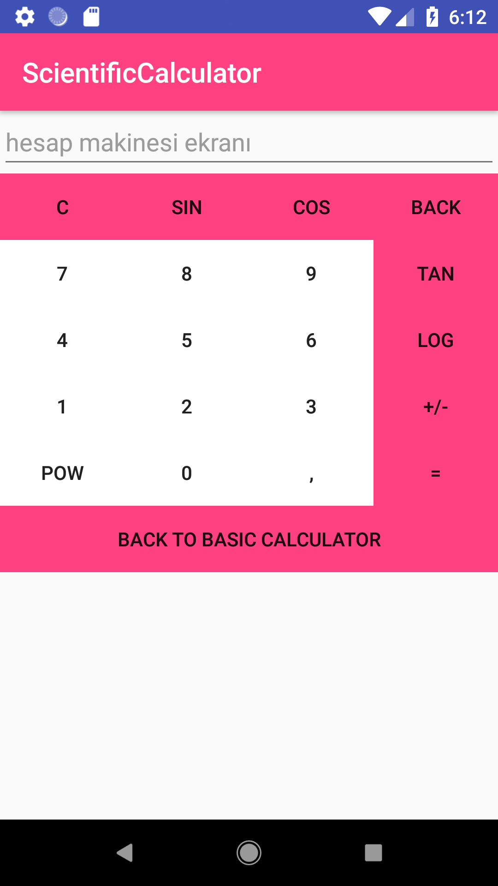

# AndroidApplications
This repository include some Android applications.

<b> <i>1. Scientific Calculator</i></b>

This project provide basic calculation operations and some scientific operations like tan,sin,log etc.

  
