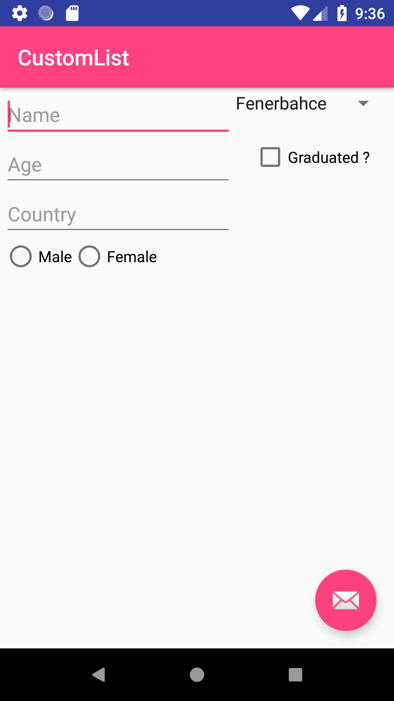

# AndroidApplications
This repository include some Android applications.

<b> <i>1. Scientific Calculator</i></b>

This project provide basic calculation operations and some scientific operations like tan,sin,log etc.

  <i><u>Screenshots:</u></i>

  

<b> <i>2. Creating List from Survey</i></b>

This applications take information about user and create a list from this informations. 

  <i><u>Screenshots:</u></i>

  

<b> <i>3. MyFoodNotes </i></b>

MyFoodNotes application is a diary of places where you go for eating. You can evaulate places, foods or drinks with ratings and comments. Therefore, you can remember your experiences and the next times you can make plans according the your rating and comments.
  <i><u>Screenshots:</u></i>
